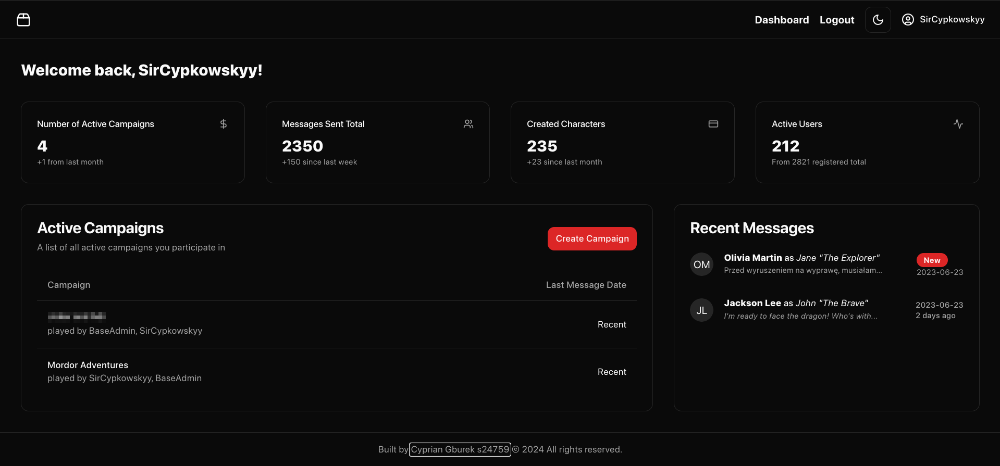
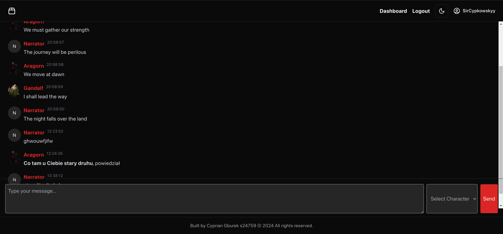

# RoleplayCampaignManager - PJATK-MAS Final Project

[All Screenshots](static/)

[UML](UML/)

An application for managing RPG campaigns and real-time chats, created as part of the final project for the Modeling and Analysis of Information Systems course at PJATK.

Below, I have included a collection of instructions needed to run the application, as well as a description of its functionalities.

**A strong request** - do not copy the code directly from this repository to your final project. All work is checked for plagiarism, and copied code may result in failing the course. My code is publicly available to showcase my programming skills and help other students learn, not to enable easy copying and replication in their projects.

## Table of Contents

1. [Functionalities](#functionalities)
2. [Running Instructions](#running-instructions)
3. [Sources](#sources)
4. [Technologies](#technologies)

## Functionalities

- [x] User registration.
- [x] User login via email and password OR using an external provider (Discord) via OAuth2.
- [x] Connecting to campaign chats (based on ASP.NET SignalR).
- [x] Sending real-time messages as the narrator or a specific controlled character.
- [x] Receiving real-time messages.
- [x] Automatically assigning users to campaigns based on their role (GM/Player).

- Unimplemented functionalities:
- [ ] Ability to create new campaigns.
- [ ] Ability to add new characters to campaigns.
- [ ] Ability to remove characters from campaigns.
- [ ] Ability to delete campaigns.
- [ ] Ability to change campaign name.
- [ ] Ability to change character name.
- [ ] Ability to change user role in the campaign.
- [ ] Ability to change user password.
- [ ] Ability to change user email address.
- [ ] Ability to change username.
- [ ] Ability to change user profile picture.
- [ ] Ability to change character picture.
- [ ] Ability to change character description.
- [ ] Ability to change campaign picture.
- [ ] Ability to change campaign description.
- [ ] Ability to delete messages.
- [ ] Ability to edit messages.
- [ ] Ability to delete user account.

To see the full list of functionalities, visit the [UML folder](UML) and check the application's UML diagrams.

## Running Instructions

Running the application without full containerization:

1. Change the connection string in the `appsettings.json` file (in the MasFinalProj.Api folder) to your own, or create a Docker container with the database using the docker-compose.yml file (use the command `docker compose up -d db` in the folder where the docker-compose file is located).
2. Run migrations by typing in the console (in the MasFinalProj.Api folder) `dotnet ef database update -p ../MasFinalProj.Persistence -c DatabaseContext -s .`.
3. Run the application.

Running the application with containerization:

1. Start the containers by typing `docker compose up -d` in the console.
2. Run migrations by typing in the console (in the MasFinalProj.Api folder) `dotnet ef database update -p ../MasFinalProj.Persistence -c DatabaseContext -s .`.

Adding a new migration:
`dotnet ef migrations add <MigrationName> -p ../MasFinalProj.Persistence -c DatabaseContext -s .`

## Sources

- Images: https://www.optionalrule.com/2021/03/10/imagery-art-resources-for-rpg-creators/
- Icons: https://game-icons.net/

## Technologies

Backend:
- ASP.NET Core 8.0 - framework for creating web applications
- Entity Framework Core 8.0 - ORM for database handling
- ASP.NET Core SignalR - library for real-time communication
- FluentValidation - library for model validation

Frontend:
- React.js - library for building user interfaces
- TypeScript - a superset of JavaScript
- Vite.js - tool for building web applications
- Tailwind CSS - CSS framework for rapid application styling
- Shad.cn - library of ready-made React/TailwindCSS components for quick UI development
- Zustand - library for global state management in the application
- React Router - library for managing navigation and routing in the application
- microsoft/signalr - library for server communication using the SignalR protocol for real-time messaging
- RadixUI - library of ready-made React components, dependency for Shad.cn, for quick UI development
- Cookies - library for managing cookies in the client application
