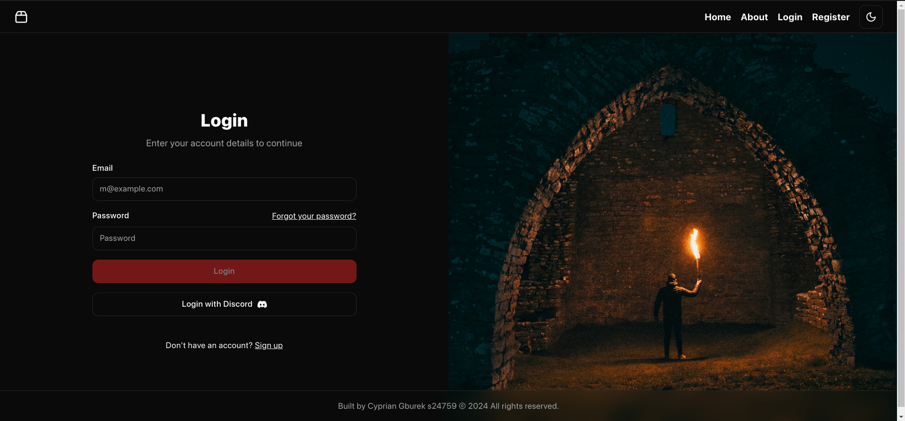
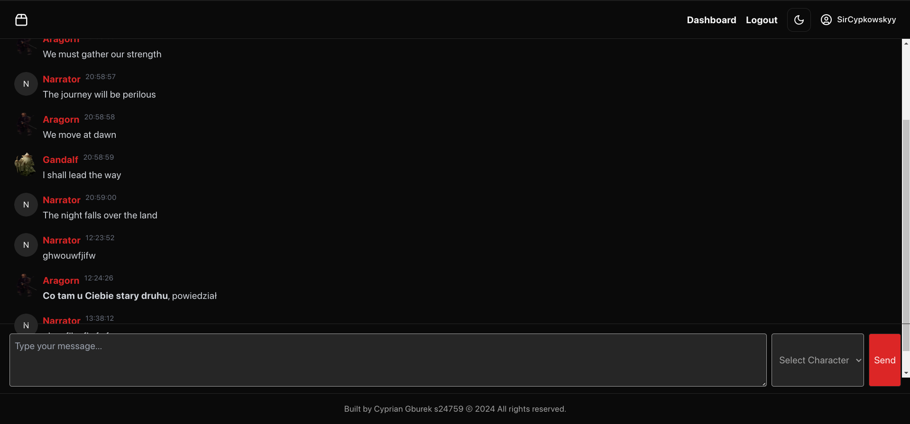
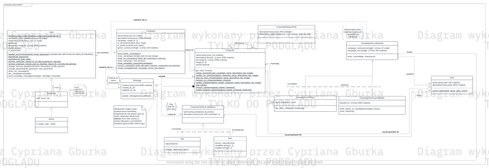

# RoleplayCampaignManager - PJATK-MAS Final Project

**[Click here for the English version](README.en.md)**

[Wszystkie Zrzuty ekranu](static/)

[UML](UML/) 

Aplikacja do zarządzania kampaniami i czatami RPG w czasie rzeczywistym, stworzona w ramach projektu końcowego z przedmiotu Modelowanie i Analiza Systemów informacyjnych na PJATK.

Poniżej zawarłem kolekcje instrukcji potrzebnych do uruchomienia aplikacji, a także opis funkcjonalności.

**Gorąca prośba** - nie kopiuj kodu bezpośrednio z tego repozytorium do swojego projektu końcowego. Wszystkie prace są sprawdzane pod kątem plagiatu, a skopiowany kod może skutkować niezaliczeniem przedmiotu. Mój kod jest dostępny publicznie, aby pokazać moje umiejętności programistyczne i pomóc innym studentom w nauce, nie zamieściłem go tutaj, aby umożliwić innym jego łatwe kopiowanie i powielanie w swoich projektach.

## Spis treści

1. [Funkcjonalności](#funkcjonalności)
2. [Instrukcje uruchomienia](#instrukcje-uruchomienia)
3. [Źródła](#źródła)
4. [Technologie](#technologie)

## Funkcjonalności

- [x] Rejestracja użytkowników.
- [x] Logowanie użytkowników przez email i hasło LUB z pomocą zewnętrznego dostawcy (Discord) w ramach OAuth2.
- [x] Łączenie się do czatów kampanii (w oparciu o ASP.NET SignalR).
- [x] Wysyłanie wiadomości w czasie rzeczywistym jako narrator lub konkretna z kontrolowanych postaci.
- [x] Odbieranie wiadomości w czasie rzeczywistym.
- [x] Automatyczne przypisywanie użytkowników do kampanii na podstawie ich roli (GM/Player).

- Niezrealizowane funkcjonalności:
- [ ] Możliwość tworzenia nowych kampanii.
- [ ] Możliwość dodawania nowych postaci do kampanii.
- [ ] Możliwość usuwania postaci z kampanii.
- [ ] Możliwość usuwania kampanii.
- [ ] Możliwość zmiany nazwy kampanii.
- [ ] Możliwość zmiany nazwy postaci.
- [ ] Możliwość zmiany roli użytkownika w kampanii.
- [ ] Możliwość zmiany hasła użytkownika.
- [ ] Możliwość zmiany adresu email użytkownika.
- [ ] Możliwość zmiany nazwy użytkownika.
- [ ] Możliwość zmiany zdjęcia profilowego użytkownika.
- [ ] Możliwość zmiany zdjęcia postaci.
- [ ] Możliwość zmiany opisu postaci.
- [ ] Możliwość zmiany zdjęcia kampanii.
- [ ] Możliwość zmiany opisu kampanii.
- [ ] Możliwość usuwania wiadomości.
- [ ] Możliwość edycji wiadomości.
- [ ] Możliwość usunięcia konta użytkownika.

Aby zobaczyć pełną listę funkcjonalności, odwiedź [folder UML](UML) i zobacz diagramy UML aplikacji.

## Instrukcje uruchomienia

Uruchamianie aplikacji bez całkowitej konteneryzacji:

1. Zmień connection string w pliku `appsettings.json` (w folderze MasFinalProj.Api) na swój, lub utwórz kontener Docker z bazą danych, korzystając z pliku docker-compose.yml (użyj komendy `docker compose up -d db` w folderze, gdzie znajduje się docker-compose).
2. Uruchom migracje, wpisując w konsoli (w folderze MasFinalProj.Api) `dotnet ef database update -p ../MasFinalProj.Persistence -c DatabaseContext -s .`.
3. Uruchom aplikację.

Uruchamianie aplikacji z konteneryzacją:

1. Uruchom kontenery, wpisując w konsoli `docker compose up -d`.
2. Uruchom migracje, wpisując w konsoli (w folderze MasFinalProj.Api) `dotnet ef database update -p ../MasFinalProj.Persistence -c DatabaseContext -s .`.

Dodawanie nowej migracji:
`dotnet ef migrations add <MigrationName> -p ../MasFinalProj.Persistence -c DatabaseContext -s .`

## Źródła

- Zdjęcia: https://www.optionalrule.com/2021/03/10/imagery-art-resources-for-rpg-creators/
- Ikony: https://game-icons.net/

## Technologie

Backend:
- ASP.NET Core 8.0 - framework do tworzenia aplikacji webowych
- Entity Framework Core 8.0 - ORM do obsługi bazy danych
- ASP.NET Core SignalR - biblioteka do obsługi komunikacji w czasie rzeczywistym
- FluentValidation - biblioteka do walidacji modeli

Frontend:
- React.js - biblioteka do tworzenia interfejsów użytkownika
- TypeScript - nadzbiór JavaScriptu
- Vite.js - narzędzie do budowania aplikacji webowych
- Tailwind CSS - framework CSS (w celu szybkiego stylowania aplikacji)
- Shad.cn - biblioteka gotowych komponentów React/TailwindCSS (w celu szybkiego tworzenia interfejsu użytkownika)
- Zustand - biblioteka do globalnego zarządzania stanem aplikacji
- React Router - biblioteka do zarządzania nawigacją i routingiem w aplikacji
- microsoft/signalr - biblioteka do obsługi komunikacji z serwerem za pomocą protokołu SignalR (w celu obsługi komunikatów w czasie rzeczywistym)
- RadixUI - biblioteka gotowych komponentów React, dependency Shad.cn (w celu szybkiego tworzenia interfejsu użytkownika)
- Cookies - biblioteka do zarządzania ciasteczkami w aplikacji klienta
