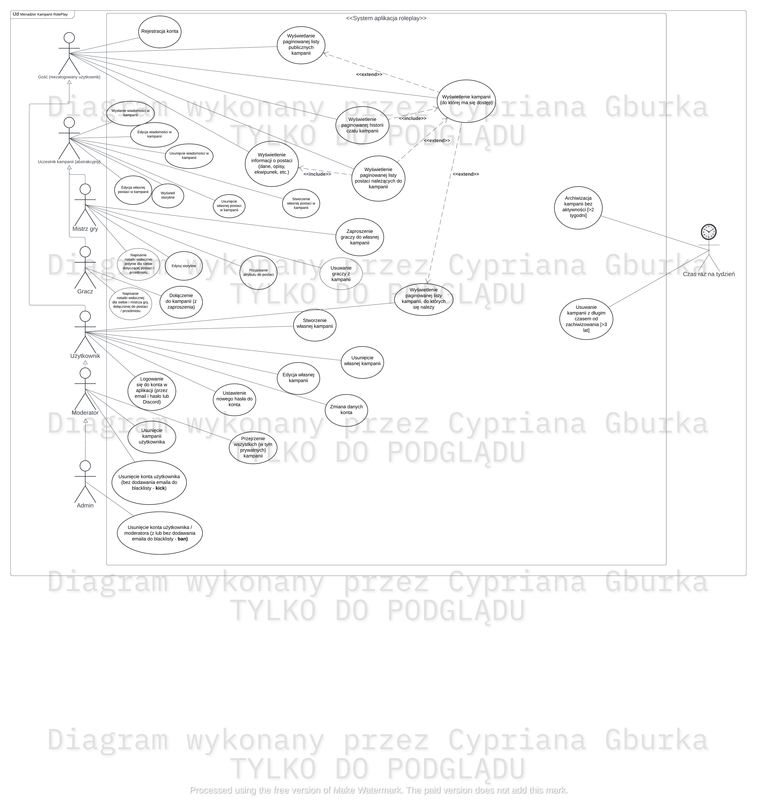
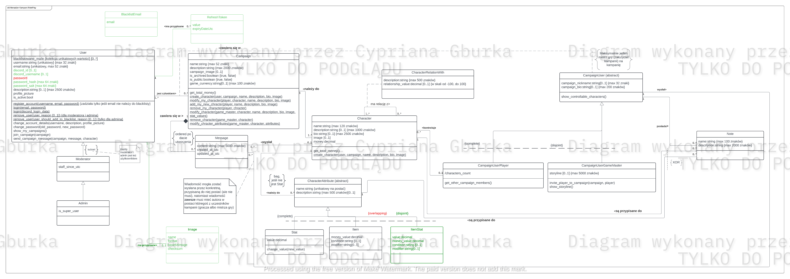
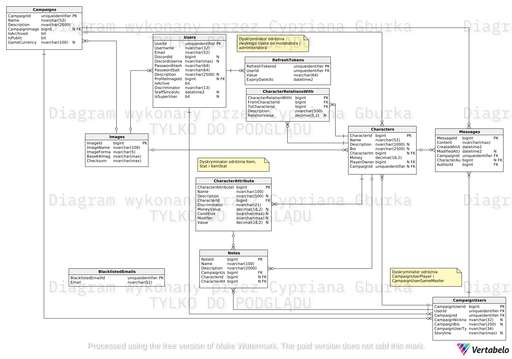

# Diagramy UML projektu

Poniżej dostępne są wszystkie diagramy UML, na bazie których dokonałem implementacji swojego końcowego projektu.

## Diagram Przypadków Użycia

## Analityczny Diagram Klas

## Projektowy Diagram Klas

### Projektowy Diagram Klas w formie Diagramu ERD

## Inne

Pozostałe, przykładowe diagramy (stanu, aktywości) dostępne są w tym folderze do swobodnego przejrzenia.
